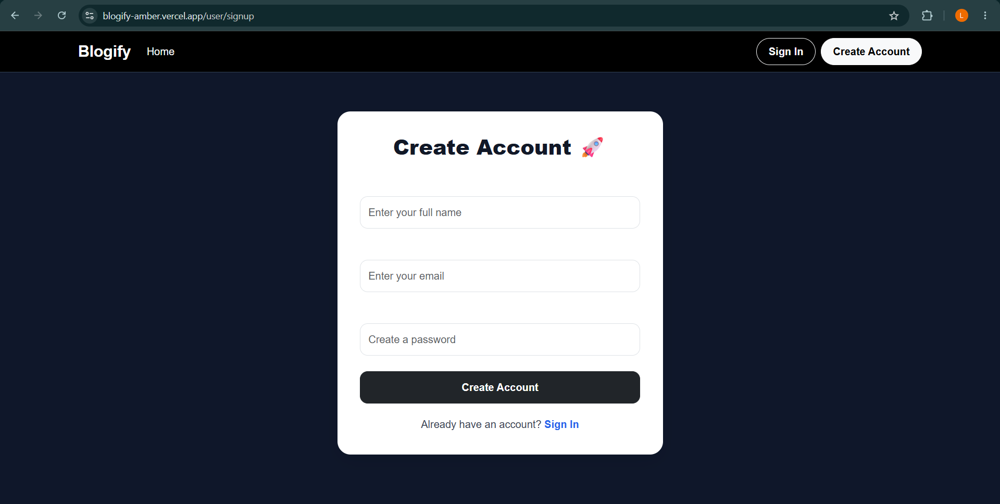
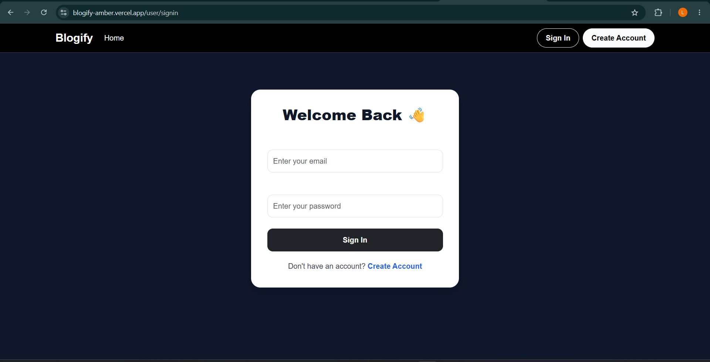
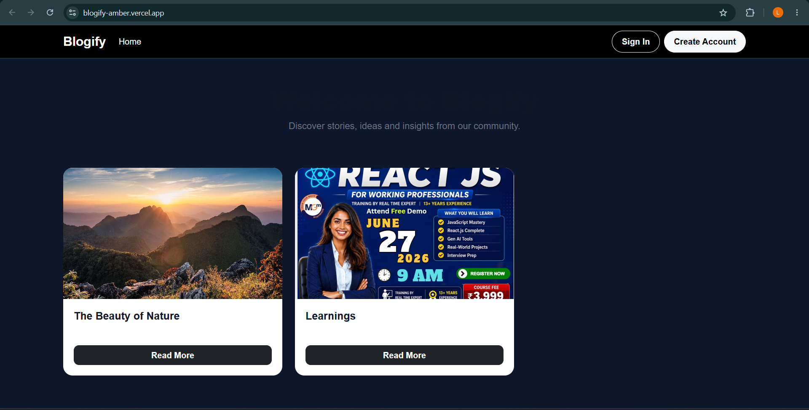

# 📝 BLOGIFY – Full Stack Blog Platform


A scalable full-stack blogging platform where users can create accounts, publish blogs, upload images, and interact through comments. Built with Node.js, Express, MongoDB, and Cloudinary for media storage.


## 🚀 Features

### 👤 Authentication System
- User signup & login
- Password hashing using bcrypt
- JWT-based authentication
- Protected routes for secure access

### 📝 Blog Management
- Create, edit, delete blogs
- View all blogs or single blog page
- User-specific blog ownership
- Timestamp-based sorting

### 💬 Comment System
- Add comments on blogs
- View comments under each blog
- Authenticated commenting system

### ☁️ Media Upload (Cloudinary)
- Image upload for blog thumbnails
- Cloud storage for optimized delivery
- Automatic image compression

### 🌐 Public Access
- Public blog viewing
- Shareable blog URLs
- Responsive UI for all devices


## 🧠 Architecture Overview

- MVC-based project structure
- RESTful API design
- JWT authentication middleware
- MongoDB schema relationships (User ↔ Blog ↔ Comments)
- Cloudinary integration for media handling
- Modular backend for scalability


## 🛠️ Tech Stack

**Frontend**
- HTML5
- CSS3
- JavaScript / EJS / React (as used)

**Backend**
- Node.js
- Express.js

**Database**
- MongoDB (Mongoose)

**Authentication**
- JSON Web Token (JWT)
- bcrypt.js

**Media Storage**
- Cloudinary

**Tools**
- multer
- dotenv
- cookie-parser
- nodemon


## ⚙️ Workflow

1. User signs up and logs in  
2. JWT token is generated  
3. User creates a blog post  
4. Optional image uploaded → stored in Cloudinary  
5. Blog saved in MongoDB  
6. Other users can view blogs  
7. Authenticated users can comment  
8. Data is rendered dynamically  


## 🔗 API Endpoints

### Auth Routes
```http
POST /api/auth/signup
POST /api/auth/login
```

### 📝 Blogs
```http
POST /api/blog
GET /api/blog
GET /api/blog/:id
PUT /api/blog/:id
DELETE /api/blog/:id
```
### 💬 Comments
```http
POST /api/comment/:blogId
GET /api/comment/:blogId
```

## Clone Repository

```bash
git clone https://github.com/Aryan-Kundalwal/Url-Shortner
```

## Navigate to Project Directory

```bash
cd SHORT-URL
```

## Install Dependencies

```bash
npm install
```

## Start Development Server

```bash
npm run dev
```

## 📁 Project Structure

```text
Short-Url/
│
├── Controller/
├── middleware/
├── models/
├── mservices/
├── views/
├── screenshots/
├── .gitgnore
├── connect.js
├── index.js
├── package-lock.json
├── package.json
├── vercel.json
│
└── README.md
```

## Application Screenshots

### 💺 Sign up & Login
<p align="center">
  
  
</p>

### 🛠️ Home
<p align="center">
  
  
</p>


## 📌 KEY ENGINEERING HIGHLIGHTS

- Designed a high-performance URL redirection system with minimal latency
- Implemented QR-based link distribution for mobile-first accessibility
- Built analytics pipeline for tracking URL usage in real time
- Integrated ngrok for production-like external API exposure
- Ensured modular backend design for future scalability


## 🚀 FUTURE ENHANCEMENTS

- Custom branded URLs (vanity slugs)
- Expiration-based short links
- Advanced analytics dashboard (geo/device tracking)
- User authentication & history tracking
- Rate limiting & abuse prevention system
- Custom domain mapping support


## 👨‍💻 Author

- GitHub: https://github.com/Aryan-Kundalwal  
- LinkedIn: https://www.linkedin.com/in/aryankundalwal 

